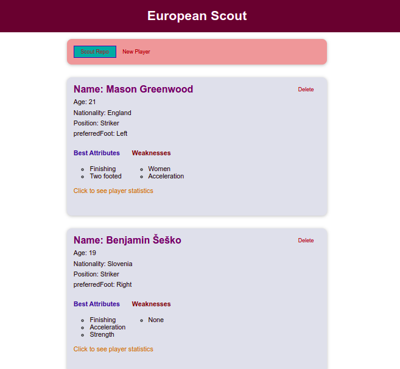

# Soccer-Player-Scout-Network-and-dashboard

To run 
1. npm install 
1. npm run serve

## Table of Contents

1. [Introduction](#introduction)

    An app to help scouts find and log the best players for their team.
2. [Installation](#installation)
    
    npm install
    npm run serve

4. [Contributing](#contributing)
    Contributing to this project is easy.
    Ask for a pull request.
    
   5. [Tests](#tests)

       Testing is easy.
       npm test
   6. [License](#license)
       This project is licensed under the MIT license.

6. [Questions](#questions)

    If you have any questions, feel free to reach out to me on [Github](
7. [Author](#author)
    Author: [EugeneLab ](

9. [License](#license)
    This project is licensed under the MIT license.

